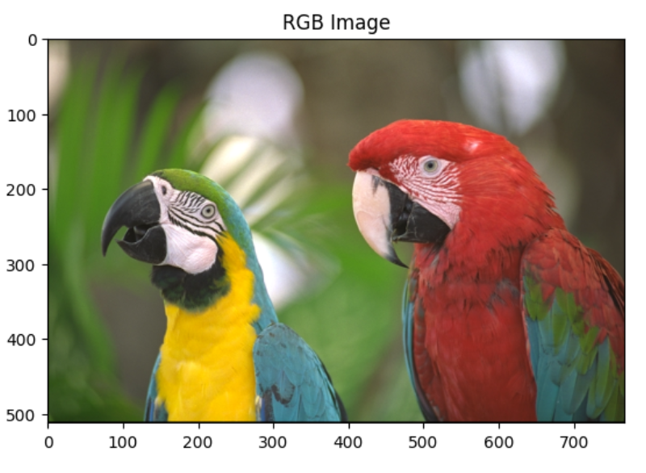
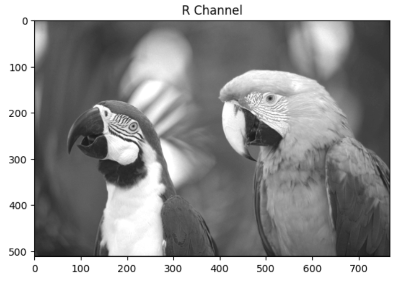
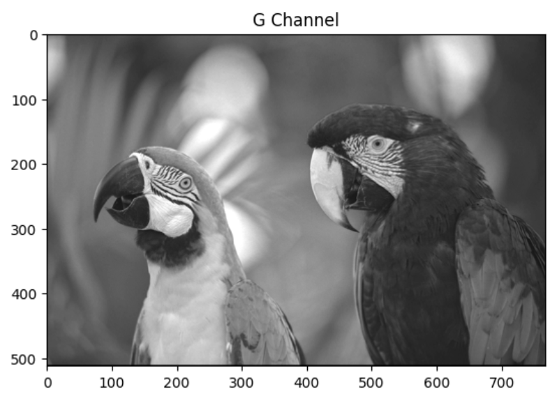
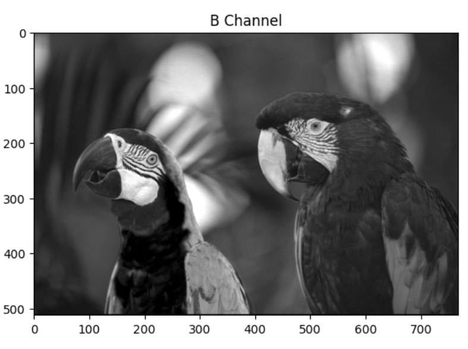
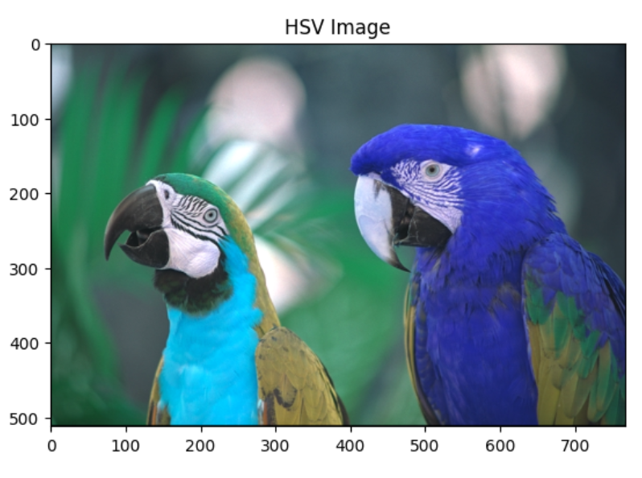
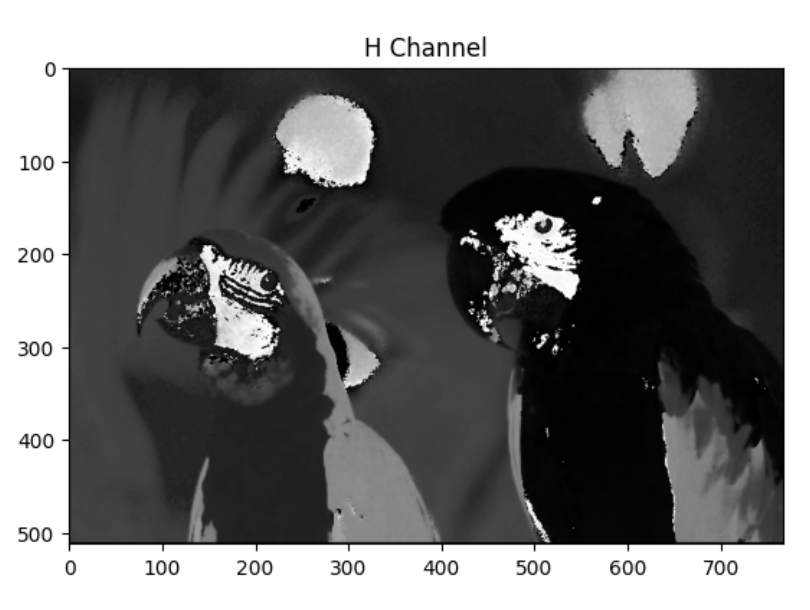
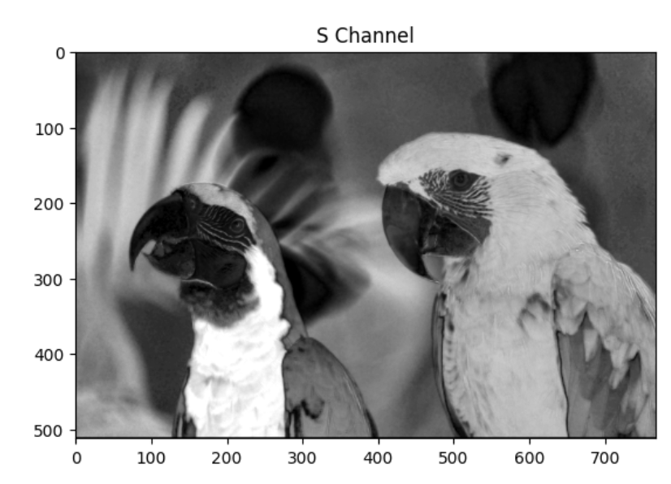
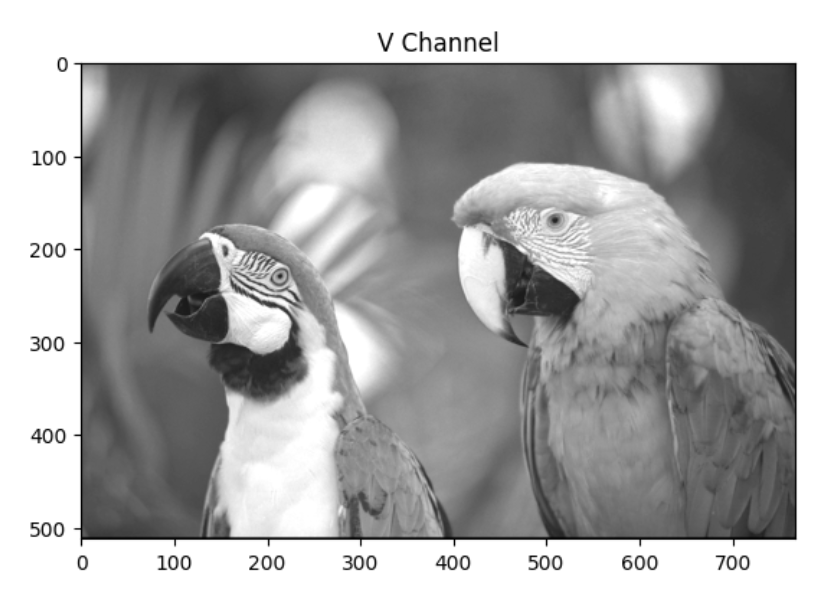
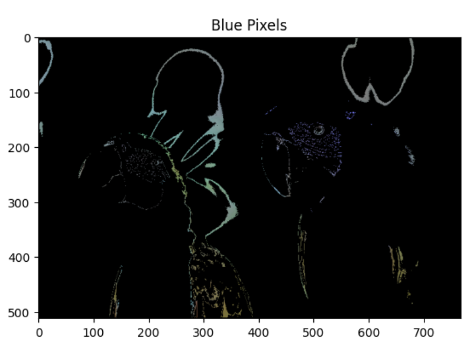

# Analyzing Color Channels for RGB and HSV Images

In this project,

The first task was to load an RGB image and display the full-color image alongside the separate Red (R), Green (G), and Blue (B) channels. The results are as below:

As it can be seen from the above plots, by seperating the channels, we are able to view the intensity of the image in each of the colors (red, green, and blue).

The next task was to convert the RGB image to the HSV (Hue, Saturation, Value) colorspace and display the Hue (H), Saturation (S), and Value (V) channels separately, using the cv2 function. The results are as below:

As it can be seen, in the Hue channel, we see color information without any brightness or saturation information. The saturation channel displays the intensity of colors in the image, and the value channel represents the brightness of the image.

Next, we wanted to identify and create a binary mask for pixels with a hue in the range [110, 130], corresponding to blue. For doing so, we used ‘cv2.inRange’ to create a mask. Next, we applied the mask to the original image by using ‘cv2.bitwise_and’. We can visualize the blue pixels on the original image, with the non-blue pixels displayed as black:

